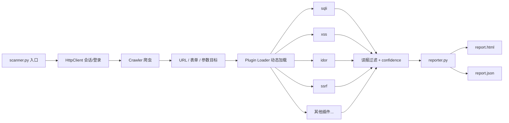

# WebVulnScanner

[](https://www.python.org/)
[](#免责声明)

基于 Python 的**插件化 Web 漏洞扫描器**，面向授权渗透测试与安全评估场景。  
支持爬虫发现、多插件并发检测、误报控制、限速与 HTML/JSON 报告输出。

> **⚠️ 仅用于已获得书面授权的目标（如自建 DVWA / Mock 靶场）。禁止对未授权系统进行扫描。**

**作者：** [Kismet0329](https://github.com/Kismet0329)  
**仓库：** https://github.com/Kismet0329/WebVulnScanner

---

## 亮点

| 能力 | 说明 |
|------|------|
| 插件化架构 | 检测逻辑独立成插件，动态加载，易于扩展新漏洞类型 |
| Web 漏洞覆盖 | SQLi、反射 XSS、IDOR、SSRF、命令注入、目录遍历、LFI 等 |
| 误报控制 | 参数白名单、响应净化、相似度阈值、confidence 分级 |
| 会话感知 | 自动登录、Cookie 注入、会话预检（避免未登录漏扫） |
| 爬虫引擎 | 并发爬取、表单提取、深度限制、外域过滤、跳过 logout |
| 限速保护 | 令牌桶 + 抖动 + 固定延迟，避免对靶场造成过大压力 |
| 报告输出 | 生成 HTML / JSON 结构化报告，便于评估与归档 |

---

## 架构概览



**扫描流程：**

```
配置目标 → 会话预检 → 爬虫收集入口 → 插件并发检测 → 结果去误报 → 输出报告
```

---

## 检测插件

| 插件名 | 说明 |
|--------|------|
| `sqli` | SQL 注入（报错/布尔等基础探测） |
| `xss` | 反射型 XSS |
| `idor` | 不安全的直接对象引用 / 越权 |
| `ssrf` | 服务端请求伪造 |
| `command_injection` | 命令注入 |
| `directory_traversal` | 目录遍历 |
| `file_inclusion` | 本地/远程文件包含 |
| `unauthorized_access` | 未授权访问 |
| `sensitive_files` | 敏感文件泄露（如 robots.txt、.git 等） |
| `backup_files` | 备份文件探测 |

列出全部插件：

```bash
python scanner.py --list-plugins
```

---

## 环境要求

- Python 3.8+
- pip

## 安装

```bash
git clone https://github.com/Kismet0329/WebVulnScanner.git
cd WebVulnScanner
python -m venv venv

# Windows
venv\Scripts\activate
# Linux / macOS
# source venv/bin/activate

pip install -r requirements.txt
```

可选 JS 渲染（部分动态页面）：

```bash
pip install playwright
playwright install chromium
```

---

## 快速开始

### 1. 扫描本地 Mock DVWA（推荐入门）

```bash
# 终端 1：启动 Mock 靶场
python mock_dvwa_full.py --port 8888

# 终端 2：自动登录并扫描
python scanner.py -u http://127.0.0.1:8888/ \
  --login-url http://127.0.0.1:8888/login.php \
  --username admin --password password \
  -o report_dvwa
```

扫描完成后查看：

- `report_dvwa.html` — 可视化报告
- `report_dvwa.json` — 结构化结果
- `scanner.log` — 运行日志

### 2. 使用 Cookie 扫描

```bash
python scanner.py -u http://127.0.0.1:8888/ \
  --cookie "PHPSESSID=xxx; security=low" \
  -o report_cookie
```

> DVWA 必须带小写 `security=low`（不是 `Security=low`）。

### 3. 扫描真实 DVWA

```bash
python scanner.py -u http://127.0.0.1/DVWA/ \
  --login-url http://127.0.0.1/DVWA/login.php \
  --username admin --password password \
  --security-level low \
  -o report_dvwa
```

### 4. 只运行部分插件

```bash
python scanner.py -u http://127.0.0.1:8888/ \
  --login-url http://127.0.0.1:8888/login.php \
  --username admin --password password \
  --only-plugins sqli,xss,idor \
  -o report_partial
```

---

## 报告示例

扫描结束后会生成 HTML 报告，包含：

- 目标 URL、扫描时间、漏洞总数
- 按插件 / 严重程度 / URL 列出的漏洞清单
- 每条结果的 confidence 与详情字段

JSON 报告便于二次处理或接入其他评估流程。

---

## 主要参数

| 参数 | 说明 |
|------|------|
| `-u/--url` | 目标 URL |
| `--login-url` / `--username` / `--password` | 自动登录 |
| `--cookie` | 手动 Cookie（可多次或分号分隔） |
| `--security-level` | DVWA 等级：low/medium/high/impossible/none |
| `--threads` / `--rate` / `--depth` | 并发、限速、爬取深度 |
| `--only-plugins` / `--exclude-plugins` | 插件过滤 |
| `--verify-ssl` | 开启证书校验（默认关闭） |
| `--js-render` | Playwright 渲染 |
| `-o` | 报告文件名前缀 |

---

## 常见问题

### 为什么只扫到 1 个漏洞？

日志里若几乎只有 `sensitive_files` / `robots.txt`，通常是：

1. **登录态失效**：Cookie 过期或错误 → 受保护页 302 到登录页 → 参数插件无目标可测
2. **`Security=low` 写成了大写**：真实 DVWA 只认小写 `security`
3. **未登录就扫**：请加 `--login-url` 或有效 `--cookie`

扫描器会在启动时做**会话预检**，并在日志中提示「带参数可测目标」数量。若预检失败，请先修复登录态再扫描。

---

## 项目结构

```
WebVulnScanner/
├── scanner.py          # 入口：调度爬虫、插件、报告
├── crawler.py          # 爬虫：URL/表单发现
├── http_client.py      # HTTP 客户端：登录、Cookie、代理
├── plugin_loader.py    # 插件动态加载
├── rate_limiter.py     # 令牌桶限速
├── reporter.py         # HTML / JSON 报告
├── config.py           # 命令行参数
├── mock_dvwa_full.py   # 本地 Mock DVWA 靶场
├── plugins/            # 漏洞检测插件
│   ├── sqli.py
│   ├── xss.py
│   ├── idor.py
│   └── ...
├── tests/              # 单元测试
└── debug/              # 调试脚本
```

---

## 运行测试

```bash
python -m unittest discover -s tests -v
```

---

## 设计说明

本项目侧重将 Web 渗透测试中的**常见检测思路工程化**：

- **工具负责初筛**：快速覆盖爬虫入口与常见漏洞模式
- **手工仍不可替代**：复杂逻辑漏洞、业务越权、上下文相关 XSS 等需 Burp 人工分析
- **误报控制优先**：扫描结果带 confidence 分级，避免「一有响应就报漏洞」

适用于：授权靶场练习、安全评估辅助、漏洞检测插件开发学习。

---

## 免责声明

本工具仅供**安全研究**与**已获得书面授权的渗透测试**使用。  
使用者须确保扫描行为合法合规，并对自身行为负责。  
开发者不对任何未授权使用造成的后果承担责任。

---

## 作者
  
GitHub: [@Kismet0329](https://github.com/Kismet0329)

如有问题或建议，欢迎提交 [Issue](https://github.com/Kismet0329/WebVulnScanner/issues)。
